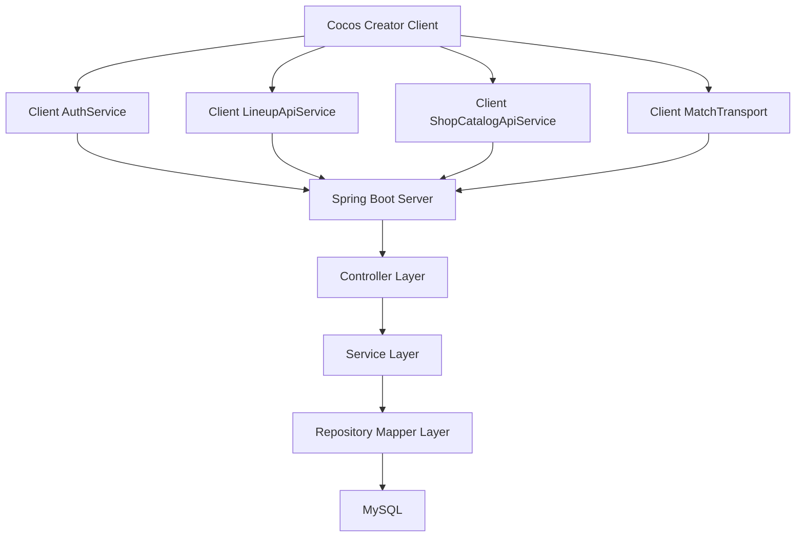

# Architecture Design Document

Project: football-bounce

Document owner: engineering

Last updated: 2026-06-20

## 1. Purpose

This document records the overall architecture of football-bounce: client/server boundaries, persistence strategy, gameplay authority, coordinate systems, online match synchronization, and future direction.

In large engineering organizations this type of document is usually called an Architecture Design Document, ADD, System Architecture Document, or High-Level Design document. This project uses Architecture Design Document because it focuses on component responsibilities and system-level design.

## 2. Product Shape

football-bounce is a vertical-screen 2D disk-football game.

Implemented product areas:

- Login, registration, guest login, auto-login, logout.
- Persistent user profile and coin balance.
- Home page with match mode entries.
- Lineup page with owned players, owned formations, selected lineup, drag/swap behavior.
- Shop page with player purchase, formation purchase, and gacha draw.
- Single-player match against AI.
- Online matchmaking and online match synchronization.
- Match record list and replay entry.
- Goal, match-end, settlement, and draw animations.

## 3. Architectural Style

Current style:

- Cocos Creator client for rendering, input, animation, local scene flow, and current match prediction.
- Spring Boot backend for accounts, inventory, wallet, lineups, shop purchases, match records, rewards, single-match server logic, online runtime state, online clock, and online validation.
- MySQL for durable state.
- HTTP polling for online match synchronization.

Target style:

- Server-authoritative gameplay.
- Client as rendering/input shell.
- Server owns gameplay results, clocks, scores, winner decisions, wallet, inventory, settlement, and replay source data.

## 4. Component Diagram



## 5. Client Architecture

### 5.1 Scenes

The Cocos project uses editable scene nodes plus TypeScript controllers.

Responsibilities:

- Login/Register scenes: collect credentials and route to home.
- Main scene: render tabs, home, lineup, shop, profile, match records, and matchmaking page.
- Match scene through `EditableMatch`: render match field, players, ball, HUD, animations, replay.
- Shop pack scene: render gacha pack list, draw animation, and result cards.

### 5.2 Client Service Layer

Client HTTP services isolate server calls:

- `AuthService`: auth, guest state, current user cache, shared `postJson`.
- `LineupApiService`: lineup GET/POST.
- `ShopCatalogApiService`: shop catalog, player detail, purchases, gacha draw.
- `SingleMatchService`: single-player match lifecycle.
- `OnlineMatchService`: online matchmaking, actions, clock, result, settlement.
- `MatchRecordService`: recent records and replay.
- `WalletService`: current wallet/profile update behavior.

### 5.3 Client State Rule

Client may cache:

- Current logged-in user summary.
- Current auth token and client instance id.
- Current selected match or replay handoff id.
- Rendering-only objects and UI state.

Client must not be the source of truth for:

- Player detail data.
- Owned player list.
- Owned formation list.
- Coin balance.
- Purchases.
- Match settlement.
- Online match winner.

Current gap:

- Online and single match still use client-side physics and fast settlement preview as part of the validation path. This is not final server-authoritative architecture.

## 6. Server Architecture

### 6.1 Controller Layer

Controllers expose `/api/*` endpoints and delegate to services.

Current controllers:

- `AuthController`
- `LineupController`
- `ShopCatalogController`
- `SingleMatchController`
- `OnlineMatchController`
- `MatchRecordController`
- `ApiExceptionHandler`

### 6.2 Service Layer

Services hold business rules:

- `UserService`: login, register, auto-login, logout, session issue/revoke.
- `GuestAccountService`: guest reset from template.
- `LineupService`: user lineup state and ownership defaults.
- `ShopService`: prices, purchases, gacha, coin deduction.
- `SingleMatchService`: in-memory single-player runtime and settlement.
- `OnlineMatchService`: waiting slot, online runtime, server clock, canonical mirror, validation, finish.
- `MatchRecordService`: recent records, replay payload, guest-session behavior.
- `MatchRewardService`: reward limits and coin income.
- `MatchRecordCleanupService`: scheduled cleanup for old records.

### 6.3 Repository Layer

Repository classes map service operations to MySQL:

- `UserMapper`
- `UserLoginSessionMapper`
- `LineupMapper`
- `CoinTransactionMapper`
- `SingleMatchMapper`
- `MatchRecordMapper`

## 7. Persistence Architecture

### 7.1 Account And Session

`user_account` stores:

- identity
- password hash
- display profile
- coins
- single/online match counters

`user_login_session` stores:

- user id
- device id
- client instance id
- token hash
- expiry
- revoked time

Architecture rule:

- One active account should not be usable by multiple devices in conflicting sessions.
- Session validation is required for online match actions.

### 7.2 Inventory

Inventory is split into:

- `player_data`: catalog.
- `formation_catalog`: catalog.
- `user_owned_player`: ownership.
- `user_owned_formation`: ownership.
- `user_lineup`: selected state.

Architecture rule:

- Client renders catalogs and ownership data returned from server.
- Client must not create fallback owned players or fallback player details when backend is unavailable.

### 7.3 Wallet

Wallet uses:

- `user_account.coins`
- `coin_transaction`

Architecture rule:

- All coin changes are server-side.
- Mutating responses should return `userSummary` so the client top bar can refresh without a separate request.

### 7.4 Match Records

Match history uses:

- `user_match_record`: one row per user's perspective. For online matches, home and away users can each have a row for the same match number.
- `match_action`: replay action data with `match_second`. Intended action types are start, action or legacy shoot-like rows, and end.
- `match_goal_record`: settlement and timeline goal data.

Architecture rule:

- Replay should be derived from canonical action data.
- Away replay requests should be localized by the server before being sent to the client.
- Away replay localization is a 180-degree transform: sides, player ids, command angle, score, and goal sides are converted before the client receives data.
- The replay client runs display clocks locally and inserts actions by `match_second`; live match clock authority remains server-side for online matches.
- Goal events are not stored in `match_action`; goals belong to `match_goal_record`.
- Replay settlement is fetched separately after the replay reaches the end action.

## 8. Match Authority Model

### 8.1 Current Hybrid Model

Current online flow:

1. Client creates input command.
2. Client immediately applies local shot and local physics.
3. Client creates fast settlement preview.
4. Client sends command to server.
5. Server converts command to canonical coordinates and simulates.
6. Server publishes command to opponent.
7. Both clients send result acknowledgements back after local animation/calculation.
8. Server ignores client snapshot/event content for winner and score authority.
9. Server confirms next turn after both acknowledgements, or ends only by server score, server clock, or acknowledgement timeout.

This keeps responsive local feedback while moving online winner, score, goal records, and match records to server authority.

Current HTTP ordering:

1. `/api/online-match/shoot` sends only the input action.
2. Server validates and publishes the canonical action immediately.
3. Server computes the authoritative result immediately from that action.
4. Each client sends `/api/online-match/result` separately after local fast settlement or display settlement.
5. Server treats those result calls as acknowledgements and confirms both results before allowing the next turn.

Action submission and post-action snapshot are therefore separate HTTP requests, not one request.

### 8.2 Target Server-Authoritative Model

Target online flow:

1. Client sends input command only.
2. Server validates turn and session.
3. Server simulates authoritative result.
4. Server broadcasts action and authoritative result packet.
5. Clients animate the same server result.
6. Client no longer decides goal, score, winner, or settlement.

Target benefit:

- No snapshot drift from client physics.
- No client-side business result authority.
- Cleaner replay because server action/result packets are the only source.

Migration plan:

- Keep `ShootCommand` as input DTO.
- Replace client `createFastSettlementPreview` result submission with server-generated result packets.
- Keep client local physics only as interpolation if it is reconciled to server packets.
- Remove client-side goal authority from online mode.

## 9. Coordinate And Mirror Architecture

### 9.1 Canonical Field

The server uses canonical field size:

- width: 362
- height: 650

All online authoritative simulation and stored online commands should use canonical coordinates.

### 9.2 Client Field Size

The client includes:

- `fieldWidth`
- `fieldHeight`

in online shoot, action poll, clock, and result requests.

Server behavior:

- Input command from client is scaled from client field to canonical field.
- Snapshot from client is scaled from client field to canonical field.
- Canonical command sent back to a client is scaled from canonical field to target client's last-known field size.

### 9.3 Away Mirror

Both clients render themselves as local home/red side.

Server behavior:

- If receiving from network away, server converts local home-looking data to canonical away data.
- Conversion is 180 degrees:
  - x becomes -x
  - y becomes -y
  - vx becomes -vx
  - vy becomes -vy
  - actor ids swap `home-*` and `away-*`
  - score and side values swap where needed
  - angle rotates by pi

Architecture rule:

- Mirroring is server-owned.
- Client should not know whether it is canonical home or canonical away.

## 10. Time Architecture

Single-player:

- Client currently displays local time and submits finish data.
- Server validates/records settlement.

Online:

- Server owns match duration and turn duration.
- Client polls `/api/online-match/clock` every 200 ms through `MatchTransport`.
- Client uses `controlEnabled` from server to decide whether input is allowed.

Architecture rule:

- Online time must remain server-owned.

## 11. Online Synchronization Architecture

Current transport:

- HTTP long polling for actions.
- HTTP polling for clock.
- HTTP post for shoot.
- HTTP post for result.

Important state:

- `requestId`: matchmaking identity and per-client match identity.
- `matchId`: online match id.
- `sinceSeq`: action polling cursor.
- `pendingResults`: client-side pending settlement confirmations.
- `fieldSizesByRequestId`: server-side latest client coordinate size map.

Failure rules:

- If a user is not in match, reject.
- If session is invalid, reject.
- If wrong turn, reject.
- If prior action is not confirmed, reject.
- If snapshot/goal validation fails, finish match and mark failing side as loser.
- If result confirmation times out, finish match against non-responsive side.

## 12. Rewards And Economy Architecture

Implemented rules:

- Single-player win reward: 10 coins.
- Online win reward: 20 coins.
- Single-player daily cap: 10 coins.
- Online daily cap: 200 coins.
- Reset is Beijing-time daily logic.

Architecture rule:

- Rewards and caps must be server-side.
- The client only displays returned coin state.

## 13. Cleanup Architecture

Implemented cleanup target:

- Delete records older than one week.
- Include match records, goal records, and action records.
- Run daily at Beijing-time midnight.

Architecture rule:

- Cleanup must preserve referential consistency.
- Large deletes should be batched before production scale.

## 14. Known Technical Debt

1. Online client still computes physics and fast settlement.
   - Risk: drift and business logic in client.
   - Target: server result packets.

2. HTTP polling is simple but inefficient for real-time online play.
   - Risk: latency and extra server load.
   - Target: WebSocket or reliable realtime channel after correctness stabilizes.

3. Online runtime is in-memory.
   - Risk: server restart loses active matches.
   - Target: keep active match runtime in memory for now; consider Redis/session recovery later.

4. Guest account is a shared id.
   - Risk: simultaneous guest sessions can conflict.
   - Target: per-session guest runtime identity or isolated guest account pool.

5. API auth is applied in selected paths, not uniformly via middleware.
   - Risk: inconsistent protection.
   - Target: server-side auth interceptor/filter for protected endpoints.

6. Documentation must be updated per commit.
   - Risk: docs drift from implementation.
   - Target: make doc update part of PR checklist.

## 15. Architecture Change Log

Each architecture-changing commit should append an entry.

Format:

```text
YYYY-MM-DD - <branch> - <commit short hash or pending>
Decision:
- What changed.
Reason:
- Why it changed.
Impact:
- Client/server/database effects.
Follow-up:
- Remaining work.
```

### 2026-06-20 - pending - documentation baseline

Decision:

- Added this Architecture Design Document as the baseline high-level design.

Reason:

- The project now has multiple subsystems and needs a single architecture reference before further backend authority changes.

Impact:

- No runtime code changes in this documentation-only entry.

Follow-up:

- Move online match from hybrid client-prediction/server-validation to server-authoritative result packets.

### 2026-06-20 - pending - replay local perspective correction

Decision:

- Online replay responses for canonical away users are normalized to local home perspective.
- Client replay initialization now derives the starting turn from the first replay shoot action.

Reason:

- Both live play and replay must obey the same perspective rule: the viewer is always local home/red, and the original opponent is local away/blue.

Impact:

- Canonical home actions become local away actions for an away viewer.
- Canonical away actions become local home actions for an away viewer.
- Replay no longer rejects the first mirrored away action due to an incorrect initial home turn.

Follow-up:

- Add automated replay-localization tests around `MatchRecordService`.
